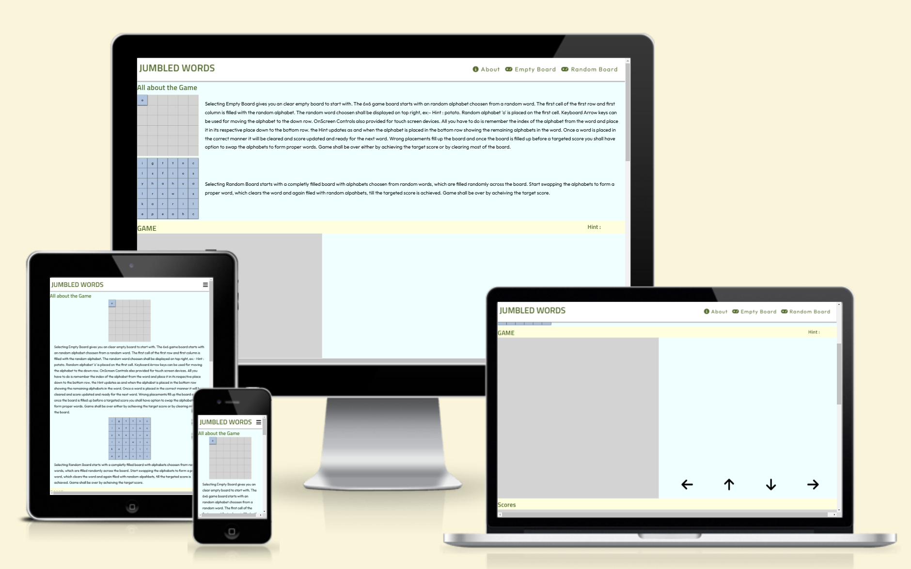
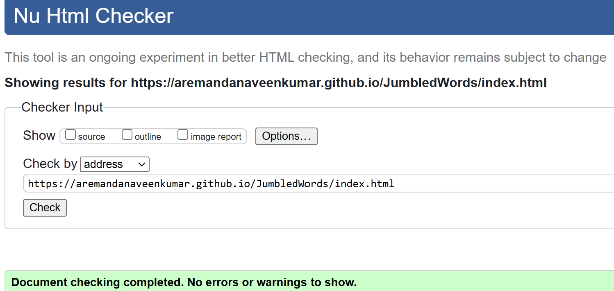
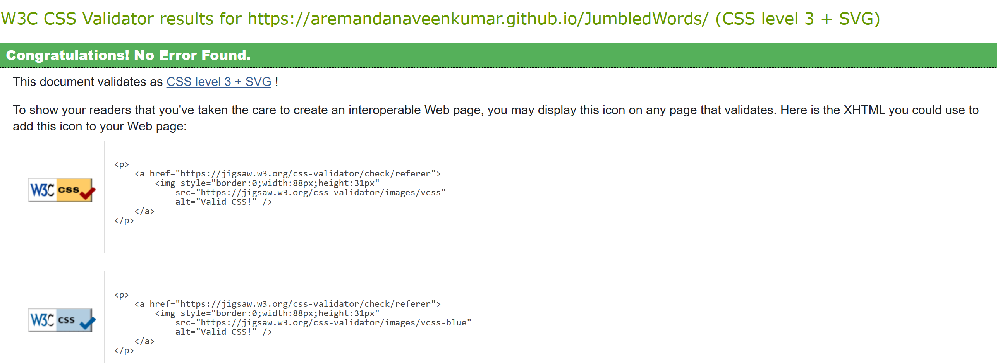
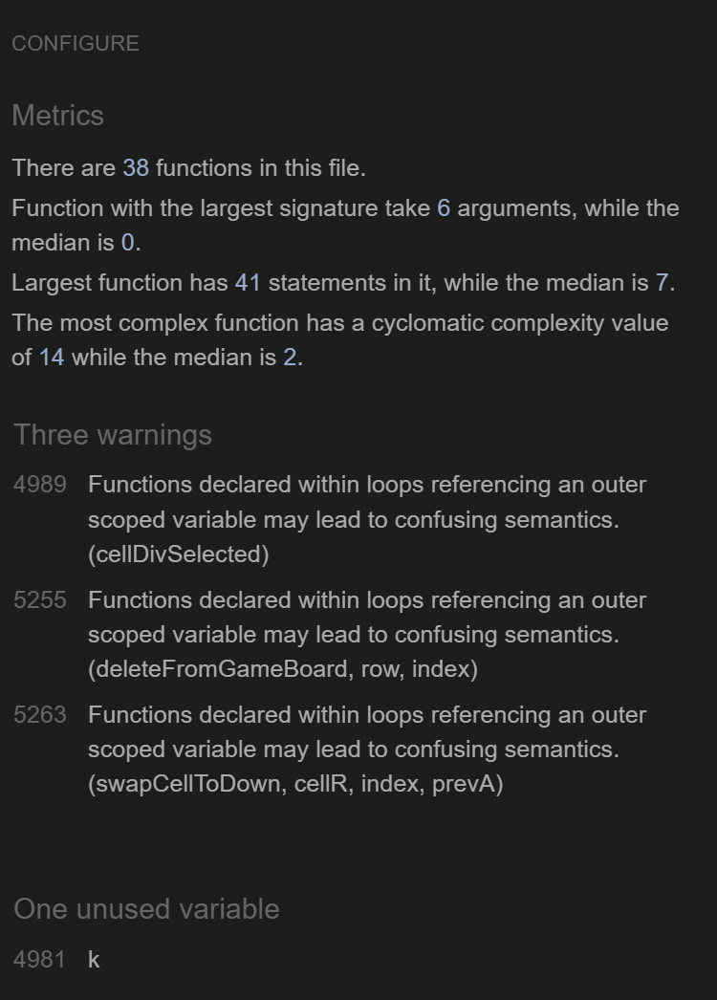
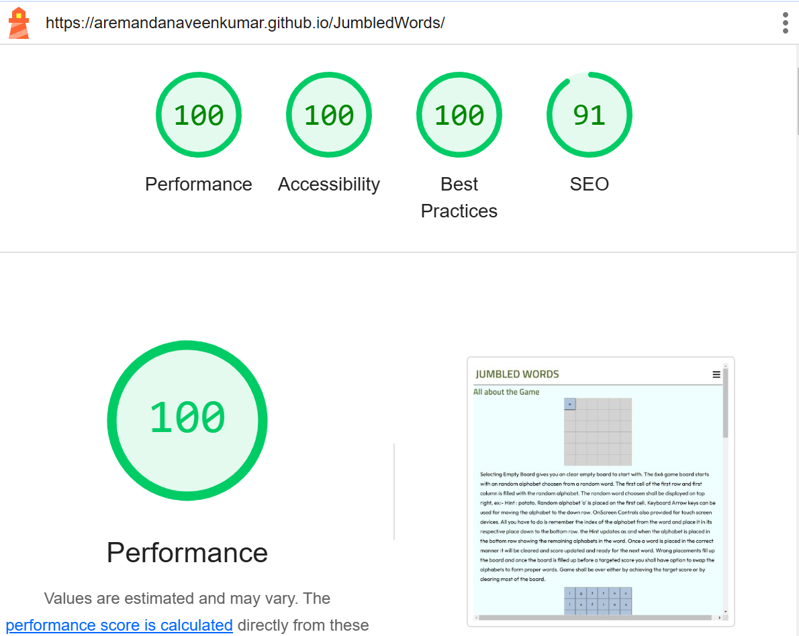

# JumbledWords
The site is one of many gaming sites / apps which provide word game 
enthusiastics to keep their brian sharp

## Features
The site main features are to provide word gamers a little time to play.

### Existing Features
- __Navigation Bar__

The fully responsive navigation bar including links to the Logo/Site Title, a link to know about/ how to play game, a link to two different style of word game boards, and finally the scores for the game being played.

### Features Left To Implement

- Random Board is yet to be implemented.
- Adding graphics / animations for the game itself

## Testing

- The site is being extensively tested over different virtual screen sizes and orientations - Potrait & Landscape.

- Mainly testing was carried out on an 17 inch Laptop, Microsoft Surface Pro 7, Apple Iphone 16 Pro Max, Apple Iphone 12, Apple Ipad Air4 & Apple Ipad Pro 12.9

### Validator Testing

- HTML Validator checking passed with no errors

- CSS Validator checking passed with no errors

- JS Hint Validator checking passed with 3 warnings

- Lighthouse Score tested on Chrome Browser.

## Deployment

- The site was deployed to GitHub pages. The steps to deploy are as follows: 
  - In the GitHub repository, navigate to the Settings tab 
  - From the source section drop-down menu, select the Master Branch
  - Once the master branch has been selected, the page will be automatically refreshed with a detailed ribbon display to indicate the successful deployment. 

The live link can be found here - https://aremandanaveenkumar.github.io/JumbledWords/

### Content

 - The Words list was downloaded from the site - https://www.mit.edu/~ecprice/wordlist.10000 and words length greater than 2 and less than 7 were being segregated so that can be used in the site for testing purpose.

  - Later the same can be done using an online api for random word and checking the validity of word.